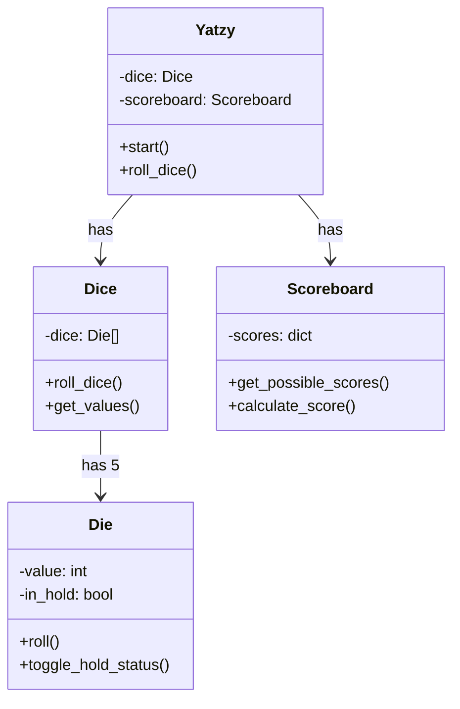
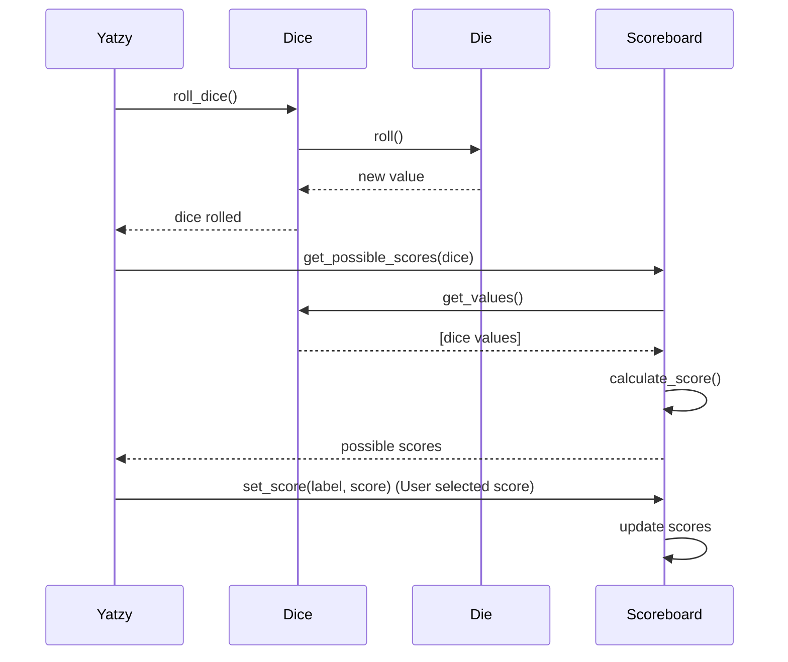

# Architecture

```mermaid
classDiagram
    class Yatzy {
        -dice: Dice
        -scoreboard: Scoreboard
        +start()
        +roll_dice()
    }
    class Dice {
        -dice: Die[]
        +roll_dice()
        +get_values()
    }
    class Die {
        -value: int
        -in_hold: bool
        +roll()
        +toggle_hold_status()
    }
    class Scoreboard {
        -scores: dict
        +get_possible_scores()
        +calculate_score()
    }

    Yatzy --> Dice : has
    Yatzy --> Scoreboard : has
    Dice --> Die : has 5
```

## Nopan heitto ja tuloksen valitseminen

```mermaid
sequenceDiagram
    participant Y as Yatzy
    participant D as Dice
    participant Die as Die
    participant S as Scoreboard

    Y->>D: roll_dice()
    D->>Die: roll()
    Die-->>D: new value
    D-->>Y: dice rolled

    Y->>S: get_possible_scores(dice)
    S->>D: get_values()
    D-->>S: [dice values]
    S->>S: calculate_score()
    S-->>Y: possible scores

    Y->>S: set_score(label, score) (User selected score)
    S->>S: update scores

```
