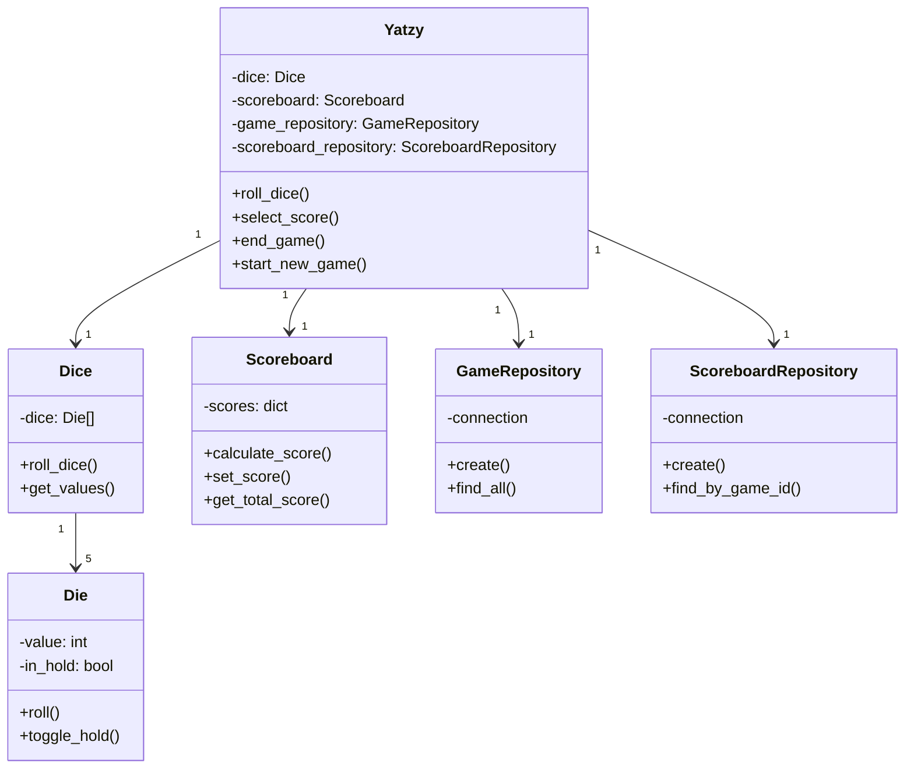
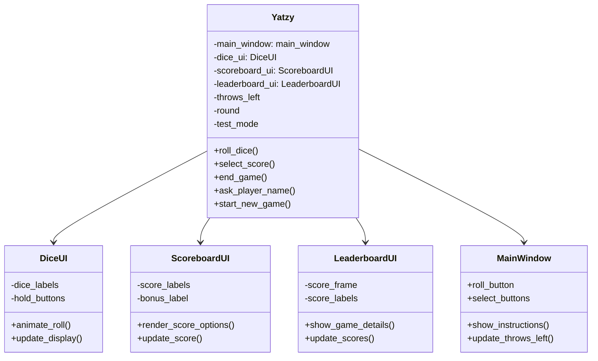
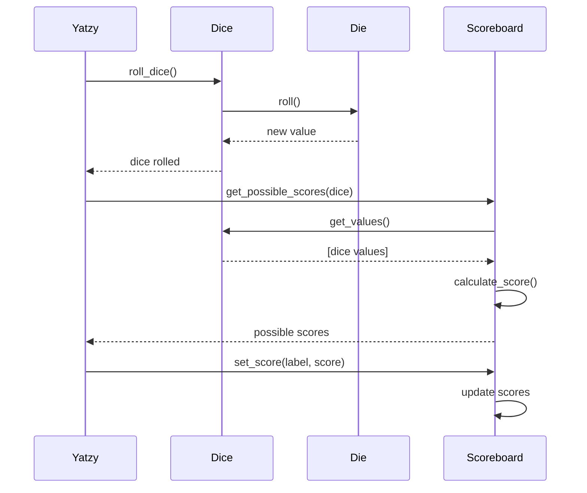

# Architecture
Pelin kulusta vastaa Yatzy.py joka kommunikoi pelilogiikka-moduulien sekä tietokanta repositorioiden kanssa.

## Käyttöliittymä

Nopilla (Dice) ja tulostaululla (Scoreboard) on omat erilliset käyttöliittymä tiedostot Dice_ui.py ja Scoreboard_ui.py, jotka löytyvät /ui kansiosta. Näiden lisäksi sieltä löytyy leaderboard_ui.py joka vastaa parhaan 10 tuloksen lista-näkymästä.

Main_window.py tiedosto vastaa pääikkunan perusrakenteen lisäksi sellaisista ui-komponenttien määrittelemisistä, jotka vaativat kommunikointia useamman moduulin kanssa. Esimerkiksi 'valitse'-näppäimet määritellään main_window:ssa, koska niiden painaminen tekee muutoksia sekä Scoreboard_ui:hin että Dice_ui:hin.

Käyttöliittymän yhdistämisesta pelilogiikkaan vastaa Yatzy.py, joka on tekemisissä kaikkien käyttöliittymäkomponenttien kanssa ja vastaa pelin päätoiminnoista kuten heittämisestä, tuloksen valitsemisesta ja pelin loppumisesta. Myös aikaisemmin mainittujen main_window:n ui-komponenttien toiminnalisuus määritellään Yatzy.py:ssa

### Käyttöliittymän rakenne

## Tietokannan rakenne
Pelien tiedot tallennetaan SQLite-tietokantaan käyttäen repository suunnittelumallia. Sisältää kaksi taulua: games ja scoreboards:
- games: tallennetaan pelien perustiedot (nimimerkki, kokonaispisteet, aika)
- scoreboards: tallennetaan yksittäisen pelin tarkemmat pisteytystiedot.
- GameRepository: pelien tallennus/haku
- ScoreboardRepository: pistetaulukoiden tallennus/haku

Peli tallennetaan ensin games-tauluun ja
saatu ID käytetään scoreboards-taulussa viiteavaimena.
Aikaleimat generoituu automaattisesti

## Pelin toiminta-esimerkki (Sekvenssikaavio)
Nopan heitto ja sen pisteytys.

