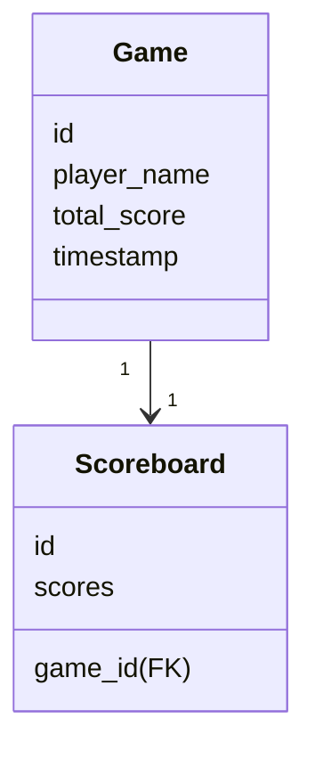
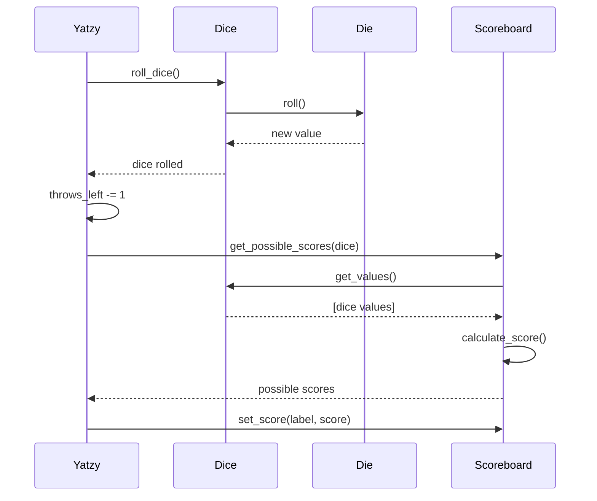

# Architecture
Yatzy-luokka vastaa pelin kulusta, käyttöliittymän hallinnasta ja luokkien välisestä toiminnallisuudesta.
Yatzyn konstruktorissa alustetaan tietokanta, pelilogiikan moduulit ja niiden käyttöliittymät.
Yatzy sisältää metodeina pelin päätoiminnot, jotka ovat: noppien heitto (roll_dice), tuloksen valitseminen (select_score), pelin loppuminen (end_game) ja uuden pelin aloittaminen (start_new_game).
Tuloksen valitsemisen yhteydessä tarkistetaan onko 15 kierrosta tullut täyteen, jolloin peli päättyy. Tällöin kutsuttava metodi (end_game) vastaa nimimerkin kysymisestä ja tuloksen tallentamisesta tietokantaan-

## Käyttöliittymä

Käyttöliittymä koostuu yhdestä pääikkunasta jossa on näkyvissä nopat, tulostaulu, näiden painikkeet, sekä top 10 tulokset.

Nopilla (Dice) ja tulostaululla (Scoreboard) on omat erilliset käyttöliittymä tiedostot Dice_ui.py ja Scoreboard_ui.py, jotka löytyvät /ui kansiosta. Näiden lisäksi sieltä löytyy leaderboard_ui.py joka vastaa parhaan 10 tuloksen lista-näkymästä.

Main_window.py tiedosto vastaa pääikkunan perusrakenteen lisäksi sellaisista ui-komponenttien määrittelemisistä, jotka vaativat kommunikointia useamman moduulin kanssa. Esimerkiksi 'valitse'-näppäimet määritellään main_window:ssa, koska niiden painaminen tekee muutoksia sekä Scoreboard_ui:hin että Dice_ui:hin.

Käyttöliittymän yhdistämisesta pelilogiikan kanssa vastaa Yatzy-luokka. Myös aikaisemmin mainittujen main_window:n ui-komponenttien toiminnalisuus määritellään Yatzy:ssa

### Käyttöliittymän rakenne

## Tietokannan rakenne
Pelien tiedot tallennetaan SQLite-tietokantaan käyttäen repository suunnittelumallia. Sovelluksella on käytössä kaksi taulua: games ja scoreboards:
- games: tallennetaan pelien perustiedot (nimimerkki, kokonaispisteet, ajankohta)
- scoreboards: tallennetaan yksittäisen pelin tarkemmat pisteytystiedot.
- GameRepository: pelien tallennus/haku
- ScoreboardRepository: pistetaulukoiden tallennus/haku

Päättynyt peli tallennetaan ensin games-tauluun ja
saatu ID käytetään scoreboards-taulussa viiteavaimena.

## Pelin toiminta-esimerkkejä
### Noppien heitto ja tulosvaihtoehtojen lasku ja valinta

