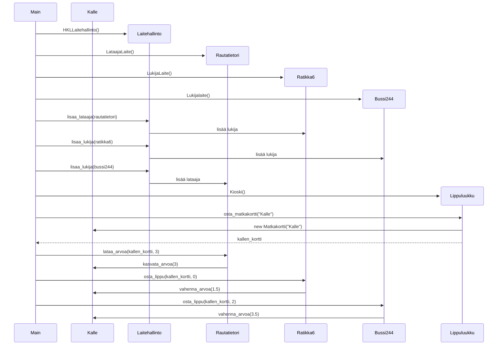

## HSL-matkakorttien sekvenssikaavio

```mermaid
sequenceDiagram
    participant Main
    participant Kalle
    create participant Laitehallinto
    Main->>Laitehallinto: HKLLaitehallinto()

    create participant Rautatietori
    Main->>Rautatietori: LataajaLaite()

    create participant Ratikka6
    Main->>Ratikka6: LukijaLaite()

    create participant Bussi244
    Main->>Bussi244: Lukijalaite()

    Main->>Laitehallinto: lisaa_lataaja(rautatietori)
    Laitehallinto->>Ratikka6: lisää lukija
    
    Main->>Laitehallinto: lisaa_lukija(ratikka6)
    Laitehallinto->>Bussi244: lisää lukija  
    
    Main->>Laitehallinto: lisaa_lukija(bussi244)
    Laitehallinto->>Rautatietori: lisää lataaja

    create participant Lippuluukku
    Main->>Lippuluukku: Kioski()

    Main->>Lippuluukku: osta_matkakortti("Kalle")
    Lippuluukku->>Kalle: new Matkakortti("Kalle")
    Lippuluukku-->>Main: kallen_kortti

    Main->>Rautatietori: lataa_arvoa(kallen_kortti, 3)
    Rautatietori->>Kalle: kasvata_arvoa(3)

    Main->>Ratikka6: osta_lippu(kallen_kortti, 0)
    Ratikka6->>Kalle: vahenna_arvoa(1.5)
    
    Main->>Bussi244: osta_lippu(kallen_kortti, 2) 
    Bussi244->>Kalle: vahenna_arvoa(3.5)
```
