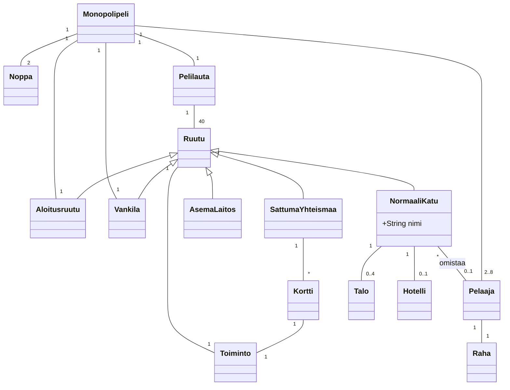

## Monopoli luokkakaavio

```mermaid
classDiagram
    Monopolipeli "1" -- "2" Noppa
    Monopolipeli "1" -- "1" Pelilauta
    Monopolipeli "1" -- "1" Aloitusruutu
    Monopolipeli "1" -- "1" Vankila
    Pelilauta "1" -- "40" Ruutu
    Ruutu "1" -- "1" Toiminto
    Ruutu <|-- Aloitusruutu
    Ruutu <|-- Vankila
    Ruutu <|-- SattumaYhteismaa
    Ruutu <|-- AsemaLaitos
    Ruutu <|-- NormaaliKatu
    Pelaaja "2..8" -- "1" Monopolipeli
    SattumaYhteismaa "1" -- "*" Kortti
    Kortti "1" -- "1" Toiminto
    NormaaliKatu "*" -- "0..1" Pelaaja : omistaa
    NormaaliKatu "1" -- "0..4" Talo
    NormaaliKatu "1" -- "0..1" Hotelli
    Pelaaja "1" -- "1" Raha
    NormaaliKatu : +String nimi
```
